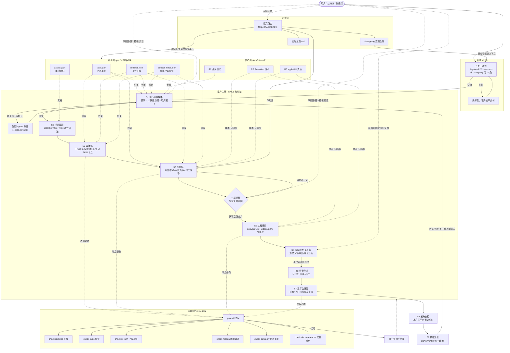

# 文档架构总览 · 券到卡包多平台宣传发布工作流

> **边界声明（读前必看）**
> 1. 本文是地图不是领土，**只载结构，不载口径**——模块划分、流转关系、角色分工、术语名称；一切数字、规则、阈值、格式要求都只指向权威文档，不在本文复述。**因此权威文档改口径不会造成本文不一致**（本文没有口径可错）。
> 2. 本文**不是权威文档**，不构成生产依据。与权威文档（`SKILL.md`、`spec/`、`docs/internal/`、`AGENTS.md`）冲突时，**一律以权威文档为准**。
> 3. 本文的作用是**路由**：让新会话 AI 知道"该去读哪份文件、不该碰哪份"，**不能替代按需精读权威文档**。
> 4. **维护规则**：只在结构变化时更新（文件增删、模块增删、引用改道），且随当轮 changelog 同轮改；口径变化不触发更新。发现本文与盘上现状不符时，以盘上现状为准。
> 5. **快照层边界**：`outputs/` 交付物（发布稿/分镜稿/成片等）是时点快照——口径只在生产时点有效，不回溯对齐；要新版走「重做/覆盖」，不改旧件。**产物分两相：未发布产物可反复修改至用户认可（在产期发现错误立即改，包括错误回流全局文档）；发布后转快照冻结，不回溯修改。**快照层不在口径唯一性扫描面内（属主外复述口径数值 = gate 硬失败，仅对注册文档生效）。
> 6. 结构变更记录：2026-09-02 初版；同日二次修订（PU/暂不投入/五层方案/待办大动作 移废纸篓，`挂账总览.md` 接棒挂账唯一之家）；同日三次修订（全文口径数字改指针，均指向 SKILL §二、check-motion、coupon-fields.json、outputs/bench/、启动提示词场景 D；挂账旧引用 2 处改新家）；同日四次修订（补快照层条款；口径唯一性机检上线，详见 changelog）；同日五次修订（本文纳入引用闸扫描面后暴露的断链修复：交付物名改 `outputs/gXX-行业/` 结构描述、08 候选清单指首份样例全路径、R3 改全称、「四层」计数复述清除，详见 changelog 第二十一轮·补12）；同日六次修订（边界声明第 5 条补产物两相：未发布可反复改至用户认可，发布后快照冻结，详见 changelog 第二十一轮·补14）；2026-09-03 七次修订（模块 12 三关判据指针由 AI启动提示词 场景 D 改道 `SKILL.md` §五——背景三关判据迁居 SKILL 成属主，氛围关升级为精致关，详见 changelog 第二十一轮·补16）。

---

# 【微信小程序-券到卡包多平台宣传发布工作流】架构总览

## 一、工作流全景图

---

## 二、模块详细说明

### 模块1：治理入口与会话恢复
- **定位**：一切 AI 会话的第一入口，保证新会话/换 AI 工具时 30 秒接手、状态一致
- **输入**：用户的任务指令；changelog 历史决策；闸门实时状态
- **输出**：工作状态判定（绿灯可开工 / 红灯先修复）→ 流向生产主线
- **关键步骤**：① 读 AGENTS.md（铁律+文档宪法四铁律）② 跑 gate-all ③ 跑 list-assets ④ 读 changelog 顶 10 条 ⑤ 按任务按需读对应手册章节（不通读全部）
- **涉及文件/工具**：`AGENTS.md`、`outputs/archive/AI启动提示词.md`（四场景模板 A 审计/B 产出/C 编码/D 素材入库）
- **关键指标**：gate-all 真实退出码（不接管道）；红灯不产出、不交付
- **关联模块**：用户 → 本模块 → 全部生产模块

### 模块2：用户协作界面
- **定位**：用户与 AI 的边界定义——用户只做三件事：给方向/说感觉、审设计稿与关键帧、看成片
- **输入**：用户的自然语言表达（含模糊感受如"这屏很空/很乱/不像"）
- **输出**：结构化的方向指令、确认/否决决策、素材（背景图）
- **关键步骤**：① 表达需求（战略简报为一页纸总览）② 三个确认节点：方向拍板、一屏标杆、逐屏真图 ③ 反馈经落点路由分流
- **涉及文件/工具**：`docs/战略简报.md`、`docs/AI使用手册.md`（口令速查、落点路由八句口令）
- **关键指标**：用户不读文档、不维护文档、不碰代码（边界纪律）
- **关联模块**：用户 → 本模块 → 选题/渲染验收/沉淀各模块的确认点

### 模块3：真源层（机器可读规格）
- **定位**：全部判断标准的唯一基座，"每类知识只有一个真源"
- **输入**：applet/ 小程序源码取证；广告法与平台规则；背景素材实物
- **输出**：`facts.json`（产品能力/约束数字/禁用声明）、`redlines.json`（画面层+口播层禁词+规则层）、`coupon-fields.json`（字段名/上限/分组归属/联动/玩法杠杆，逐行带源码行号）、`assets.json`（素材登记）→ 供生产主线与闸门消费
- **关键步骤**：① 源码取证（带行号）② 登记/更新 ③ 改后跑 gate-all ④ 记 changelog
- **涉及文件/工具**：`spec/` 四份 JSON；check-facts / check-redlines / check-ui-truth 以其为判据
- **关键指标**：真值表自证；零副本（引用不复制）
- **关联模块**：applet 源码 → 本模块 → 选题/口播/分镜/闸门全部模块

### 模块4：参考知识层
- **定位**：按需查阅的背景知识，不是作业标准（冲突时以真源为准）
- **输入**：applet 源码、SKILL 作业实践
- **输出**：R2（六大业务链路：优惠券/券包/次卡/活动海报/企微/商户入驻）、R3（帧驱动动画原理/组件 API/制作硬规则）、R6（小程序 UI 像素真值/九套主题色/动效原值）
- **关键步骤**：仅在对应步骤按需读取（R2→第1步，R3→第5/6步，R6→第4步）
- **涉及文件/工具**：`docs/internal/` 三份；受 check-doc-references 与红线扫描覆盖
- **关键指标**：与实现一致性（文档审计场景 A 核查项）
- **关联模块**：真源层/源码 → 本模块 → 选题/分镜/工程模块

### 模块5：选题与调研（SKILL 第 1 步）
- **定位**：决定"拍什么"——一个行业 = 一个系列，一条视频 = 用一条闭环故事（五拍）讲透的一套行业攻略（功能点数量口径见 `SKILL.md` §二）
- **输入**：用户指定行业或抖音后台数据（无数据则明说靠猜）；官网 quandao.lenmy.com（5 页封顶，三层采信用法：断言层不采信/玩法层回表溯源/话术层过红线）
- **输出**：`outputs/gXX-行业/00-系列规划.md`、`outputs/gXX-行业/08-候选场景清单`（10 条，每条带功能链+三态判定+官网出处）→ 用户圈 3 → 进入七步法
- **关键步骤**：① 行业调研 ② AI 发散 10 个候选场景 ③ 三态判定（已证/表缺/代码无·禁用）④ 用户圈 3 ⑤ 表缺项先回 applet 取证补真值表再动笔
- **涉及文件/工具**：官网、`spec/facts.json`、`spec/coupon-fields.json`；官网用法机制见 `官网资源库落地规划.md`（只借鉴不修改、固定阅读清单≤5页、错误台账避雷）
- **关键指标**：每个场景每一环功能可在 facts 溯源；已讲透的功能不回头重讲
- **关联模块**：用户/官网/真源层 → 本模块 → 内容策划模块

### 模块6：内容策划（SKILL 第 2~3 步）
- **定位**：决定"长什么样、说什么"——视觉母题 + 口播稿
- **输入**：圈定的候选场景；背景素材/（A 类素材，禁止 AI 生封面）；facts 能力边界
- **输出**：`outputs/gXX-行业/01-内容输入包.md`（视觉母题+色彩+动效语法+完整口播稿）→ 分镜模块
- **关键步骤**：① 从背景素材检索底图 ② 定色彩/动效语法（一套视觉语言=一个行业）③ 写口播稿：干货讲满，字数/时长/语速口径见 `SKILL.md` §二 ④ 红线+事实逐句校验 ⑤ 自检问句替代数量配额
- **涉及文件/工具**：`spec/assets.json`、`spec/redlines.json`、check-redlines
- **关键指标**：红线零命中；语速标准见 `SKILL.md` §二
- **关联模块**：选题模块 → 本模块 → 分镜模块

### 模块7：分镜设计（SKILL 第 4 步）
- **定位**：把口播稿翻译成逐屏可编码的画面方案（屏数由攻略要讲透的功能点深浅决定，口径见 `SKILL.md` §二），是内容到工程的枢纽
- **输入**：内容输入包；`coupon-fields.json`（屏上字段名逐字取自真值表，表里没有的说法不上屏不进口播）
- **输出**：`outputs/gXX-行业/07-片N-分镜稿.md`（屏序总览+逐屏画面布局/字段真值表/口播/动效/转场/帧号）→ 工程模块
- **关键步骤**：① 每屏定骨架与几何容量（行数/卡数/句数硬上限，装不下就拆屏不缩字号）② 内容屏填具体可操作信息 ③ 字段名+分组归属回真值表（组名照抄页面原生真词，清单见 `spec/coupon-fields.json` createGroups，或我方步骤序号）④ 字幕与口播逐字对齐 ⑤ 标注动效/转场/背景图编号
- **涉及文件/工具**：`spec/coupon-fields.json`、check-ui-truth（机检维度：字段名逐字/「」说法/分组归属/表外字段，层级以脚本输出为准）
- **关键指标**：check-ui-truth 零偏差；画面展示内容字段必填
- **关联模块**：内容策划 → 本模块 → 工程模块

### 模块8：工程实现（SKILL 第 5 步）
- **定位**：Remotion 帧级精确渲染的视频工程，数据驱动、一条视频一套专属 UI
- **输入**：分镜稿；R3 组件 API；R6 UI 真值
- **输出**：video/ 工程代码——数据文件 `src/data/gXX.ts`（文案/颜色全从数据读，禁止硬编码）、专属屏 `src/videos/gXX/`（ui 名带 gXX- 前缀）、注册 `scenes/index.tsx` → 渲染验收模块
- **关键步骤**：① 写数据文件（Scene 入口卡：type+ui+payload+dur+subtitles）② 写专属屏组件（禁 CSS animation/transition，全用 useCurrentFrame+interpolate/spring）③ 注册分发器（ui 缺失直接抛错，无回退旁路）④ tsc 零错误 ⑤ 行未到节拍不占位（return null）
- **涉及文件/工具**：Remotion、TypeScript、Chrome Headless Shell（NODE_OPTIONS=""）
- **关键指标**：tsc 零错误；check-similarity 防照抄上一片 ui 名（结构雷同靠一屏标杆人判）
- **关联模块**：分镜模块 → 本模块 → 渲染验收模块

### 模块9：渲染验收（SKILL 第 6 步）
- **定位**：两阶段交付闸门——先无声版后语音合成，验收只认 check-motion 数字 + 用户看真图
- **输入**：工程代码；bench 基准图（锚图 + 屏型样张，清单见 `outputs/bench/`，做屏前逐张看）
- **输出**：逐屏关键帧（每屏入场/中段/峰值至少三帧）、无声成片 → 用户审 → TTS 逐屏合成（口径见 `SKILL.md` §二）→ 有声成片、封面图 → 三平台适配模块
- **关键步骤**：① 一屏标杆（先做 1 屏渲真图，用户认可才铺其余屏）② 逐屏抽过程帧（峰值静帧干净≠这屏能看）③ check-motion 达标 ④ 用户审真图 ⑤ TTS+ffprobe 实测回填 voiceDur/帧表
- **涉及文件/工具**：Remotion render/still、`scripts/tts.mjs`、ffmpeg（atempo）、check-motion
- **关键指标**：效果尺子三指标（静止占比/中位帧间差/画面占用率，下限非质量分）+ 语速标准，数值见 check-motion 与 `SKILL.md` §二（地图不抄数字，防漂移）
- **关联模块**：工程模块 → 本模块 → 三平台适配模块；用户确认节点在此最密集

### 模块10：三平台适配与发布（SKILL 第 7 步 + 发布执行）
- **定位**：一套内容适配三种形态并上线
- **输入**：有声成片、关键帧、口播稿
- **输出**：`outputs/gXX-行业/` 下三份发布稿（03 抖音 9:16 视频 / 04 小红书 3:4 图文 / 05 搜狐 16:9 长文）→ 用户手动发布 → 数据复盘模块
- **关键步骤**：① 抖音：标题/描述/话题标签/封面帧 ② 小红书：emoji 标题/分段正文/配图（格式口径见 `SKILL.md` §二（第 7 步）） ③ 搜狐：SEO 标题/小标题长文/头图 ④ 三份过 check-redlines（画面层 codeBanned）⑤ 用户按平台发布【发布工具/账号矩阵/排期自动化：信息待补充，文档未记载】
- **涉及平台/工具**：抖音、小红书、搜狐号
- **关键指标**：红线零命中；各平台格式规范（画幅/字数/标签数）
- **关联模块**：渲染验收 → 本模块 → 数据复盘模块

### 模块11：质量闸门体系
- **定位**：横切所有步骤的机器裁判——量化不达标即阻断，不靠人判；绿灯本身要先证明可信（负向测试）
- **输入**：各步骤产出物（口播稿/分镜稿/发布稿/成片/文档/代码）
- **输出**：通过/阻断判定 + 定位到行级的报错
- **关键步骤**：gate-all 总闸调度 → check-redlines（禁词）/ check-facts（事实对账）/ check-ui-truth（上屏真值，维度以脚本输出为准）/ check-motion（画面三指标）/ check-similarity（跨片结构）/ check-doc-references（引用完整性）+ tsc 编译；list-assets 实时资产盘点
- **涉及文件/工具**：`scripts/*.mjs`；跑闸门不许接管道（防吞退出码）
- **关键指标**：真实退出码；效果尺子定标须一好一坏两片实测（calibration/）
- **关联模块**：生产主线各模块 → 本模块 → 返工或放行

### 模块12：素材管理
- **定位**：背景图/封面图的准入与登记（A 类素材必须找图，禁 AI 生图；封面禁 AI 生成）
- **输入**：用户找来的背景图
- **输出**：入库素材（9:16 居中裁剪 → 风格家族目录与命名规则见 `SKILL.md` §五）+ assets.json 登记 → 内容策划模块
- **关键步骤**：① 硬红线关 ② 精致关 ③ 缺口关（三关判据均见 `SKILL.md` §五）④ 裁剪入库+登记（浅底标 darkText:true）⑤ 前景兼容验证（临时合成 1 帧，验后删代码）⑥ check-facts 对账
- **涉及文件/工具**：`spec/assets.json`、check-facts、gate-all
- **关键指标**：三关全过才入库；不删用户原图
- **关联模块**：用户 → 本模块 → 内容策划模块

### 模块13：数据复盘与沉淀
- **定位**：闭环的收口——发布数据回流选题，决策与教训沉淀为台账/方法/挂账
- **输入**：三平台发布后数据（1h 回评/24h 看数/7d 复盘）；执行中的问题与拍板
- **输出**：下一片选题输入（回流模块5）；changelog 条目（按月分卷，只增不删）；`挂账总览.md`（唯一权威清单）；真源更新建议
- **关键步骤**：① 数据采集与复盘 ② 反馈落点路由（单片层/全局能力/产品事实/实验四类，单片反馈不动全局层）③ 升级全局须用户当轮明确确认 ④ 被否做法标"已废止"不物理删除 ⑤ 改权威文档必跑 gate-all + 记 changelog
- **涉及文件/工具**：`changelog.md`、`挂账总览.md`（唯一权威清单）、`AGENTS.md` §五（落点路由协议）
- **关键指标**：【当前无后台数据，选题"靠猜"——数据回流暂为断点，见风险1】
- **关联模块**：发布模块 → 本模块 → 选题模块（闭环）+ 治理入口（新会话恢复）

---

## 三、跨模块关联矩阵

| 模块 | 上游依赖 | 下游输出 | 共享资源/数据 |
|------|---------|---------|-------------|
| 1 治理入口 | 用户指令、沉淀层 changelog | 全部生产模块 | gate-all 状态、list-assets 资产清单 |
| 2 用户协作界面 | 用户 | 各确认节点（圈3/一屏标杆/审真图/拍板） | 战略简报、AI使用手册、落点路由协议 |
| 3 真源层 | applet 源码、平台规则 | 生产主线全部步骤、闸门体系 | facts/redlines/coupon-fields/assets 四份 JSON |
| 4 参考知识层 | applet 源码、SKILL 实践 | 选题（R2）、分镜与工程（R3/R6） | R2/R3/R6 三份参考文档 |
| 5 选题与调研 | 用户方向、官网、真源层 | 内容策划模块 | 候选场景清单、系列规划、三态判定 |
| 6 内容策划 | 选题模块、素材管理、真源层 | 分镜模块 | 内容输入包（母题+口播稿）、背景素材 |
| 7 分镜设计 | 内容策划、coupon-fields | 工程模块 | 分镜稿、字段真值表、骨架几何容量 |
| 8 工程实现 | 分镜模块、R3/R6 | 渲染验收模块 | video/ 工程、数据文件、专属屏组件 |
| 9 渲染验收 | 工程模块、bench 基准图 | 三平台适配模块 | 关键帧、无声/有声成片、bench 基准图库 |
| 10 三平台适配与发布 | 渲染验收 | 数据复盘模块 | 三份发布稿、封面图 |
| 11 质量闸门 | 生产主线各步产出 | 放行/返工判定 | scripts/*.mjs、ref-registry.json |
| 12 素材管理 | 用户找图 | 内容策划模块 | assets.json、背景素材目录 |
| 13 数据复盘与沉淀 | 发布模块、用户反馈 | 选题模块（回流）、治理入口（恢复） | changelog、挂账总览.md、落点路由 |

---

## 四、关键角色与职责

> 事实说明：本工作流的人类角色只有用户一人，无其他人类成员；"内容运营/设计/工程"等职能全部由 AI 承担，且按 AI 工具选型分工（策划文案用聊天型 AI，编码渲染用 Agent 形态编程 AI 如 Cursor/Trae/Qoder——"形态比模型重要"）。

| 角色 | 参与模块 | 核心职责 |
|------|---------|---------|
| 用户（项目所有者） | 模块 2、5、9、10、13 | 只做三件事：给方向/说感觉、审设计稿与关键帧、看成片；具体动作=圈 3 候选、方向拍板、一屏标杆认可、逐屏真图确认、提供背景素材、手动发布、看数据 |
| AI 策划（聊天型） | 模块 5、6 | 行业调研、发散 10 候选场景、视觉母题设计、口播稿撰写、自检问句深度校验 |
| AI 设计（聊天型） | 模块 6、7 | 分镜稿逐屏设计、骨架几何容量规划、关键帧构图 |
| AI 工程（Agent 型编程 AI） | 模块 8、9、11 | Remotion 编码、渲染、TTS 合成、跑闸门、看真图；对"声称已验证"一律 git diff 复核 |
| AI 素材管理 | 模块 12 | 背景图三关验收、裁剪入库、登记对账 |
| AI 沉淀（任一形态） | 模块 13 | 落点路由判定、changelog 记录、挂账维护、真源更新建议 |

---

## 五、风险点与优化建议（2026-09-02 时点）

1. **数据反馈回路断裂（最高优先级）**——文档明言"没数据就靠猜"：片 2 行业选型需用户抖音后台数据，当前无数据回流，选题闭环的最后一环是空的（挂账 5.7）。优化方向：建立最小数据台账（发布后 1h/24h/7d 三个时点手动记录播放/完播/涨粉）。
2. **真值表覆盖缺口阻断后续片**——券包创建页、次卡创建页字段真值表未建，候选场景 #1/#8/#10 标"表缺"，选中即无法开工。优化方向：用户圈 3 的同时并行启动对应表取证。
3. **语义漂移与复述副本残留**——文档宪法四铁律已立，但历史副本仍在。优化方向：发现一处消一处（减副本不是删洞察），以 check-doc-references + 定期文档审计持续收敛。
4. **"自觉条款"无机器尺子（D 组挂账）**——缓冲词/转场词/冗余%/信息单元数等仍靠 AI 自觉。优化方向：按三分法推进——口播复算固化为 check-voiceover.mjs，编码规则加 grep 级静态扫，语义计数类明标"人判"。
5. **发布执行与数据采集是手工黑箱**【信息待补充】——三平台发布动作、账号矩阵、发布时间策略、数据采集方式均无文档记载。优化方向：待首批发布数据回流后再沉淀，不前置设计。

---

## 六、关键术语对照表

> 交流统一使用"术语全称"。

| 术语全称 | 简称/别名 | 所属模块 |
|---------|----------|---------|
| 券到卡包 | 产品、小程序 | 全局（产品本体） |
| 七步法 | SKILL 七步法、唯一作业文档流程 | 生产主线 |
| 机器可读真源 | 真源、spec 真源 | 真源层 |
| 产品事实真源 | facts.json | 真源层 |
| 平台红线真源 | redlines.json、红线 | 真源层 |
| 制券字段真值表 | 真值表、coupon-fields.json | 真源层 |
| 素材登记表 | assets.json | 真源层/素材管理 |
| 开工三动作 | — | 治理入口 |
| 文档宪法四铁律 | 一物一主/引用不复制/改则同步/机器可查 | 治理入口 |
| 候选场景循环 | AI 发散 10 条→用户圈 3 | 选题与调研 |
| 三态判定 | 已证/表缺/代码无·禁用 | 选题与调研 |
| 三层采信用法 | 断言层/玩法层/话术层（官网使用纪律） | 选题与调研 |
| 视觉母题 | 母题 | 内容策划 |
| 内容输入包 | outputs/gXX-行业/ 下 01 号交付物 | 内容策划 |
| 分镜稿 | outputs/gXX-行业/ 下 07 号交付物 | 分镜设计 |
| 骨架 | 屏型骨架（内联于专属屏文件） | 分镜设计/工程实现 |
| 专属屏 | videos/gXX/ 组件 | 工程实现 |
| 数据文件 | src/data/gXX.ts | 工程实现 |
| 场景分发器 | scenes/index.tsx、VIDEO_RENDERERS | 工程实现 |
| 一屏标杆 | 一屏标杆硬闸门 | 渲染验收 |
| 过程帧三抽 | 入场/中段/峰值三帧 | 渲染验收 |
| 效果尺子 | check-motion 三指标 | 质量闸门 |
| 静止占比 | — | 质量闸门 |
| 中位帧间差 | — | 质量闸门 |
| 画面占用率 | 占用率（下限非质量分） | 质量闸门 |
| 总闸门 | gate-all | 质量闸门 |
| 上屏真值检查 | check-ui-truth（机检维度以脚本输出为准） | 质量闸门 |
| 跨片相似度检查 | check-similarity | 质量闸门 |
| 帧驱动动画 | useCurrentFrame + interpolate/spring | 工程实现 |
| 三层运动 | 底层持续微动/中层口播指向/顶层信息全景 | 内容策划/工程实现 |
| 语音合成变速 | ffmpeg atempo（数值见 SKILL §二） | 渲染验收 |
| 无声版/有声版 | 两阶段交付 | 渲染验收 |
| 基准图集 | bench（锚图 + 屏型样张，清单见 outputs/bench/） | 渲染验收 |
| 效果尺子定标 | calibration（一好一坏两片实测） | 质量闸门 |
| 站外生态词 | 站外平台名的规避措辞 | 真源层/三平台适配 |
| 落点路由 | 单片/全局/事实/实验四类分流 | 沉淀层 |
| 落层纪律 | 单片反馈不动全局层 | 沉淀层 |
| 变更台账 | changelog（按月分卷） | 沉淀层 |
| 挂账总览 | 挂账总览.md（唯一权威清单） | 沉淀层 |
| 封刀令 | 文档冻结政策 | 沉淀层 |
| 清零重启 | 2026-08-29 共享层大瘦身事件 | 工程实现（历史） |
| 行业视频编号 | gXX（如 g06=教培托管） | 全局 |
| 玩法杠杆 | playLeverage | 真源层 |
| 制券页分组归属表 | createGroups（块→真组名映射以 spec/coupon-fields.json 为准） | 真源层 |
| 消息提醒边界 | messageReminders | 真源层 |
| 引用登记表 | ref-registry.json | 质量闸门 |
| 浅色背景适配标记 | darkText:true | 素材管理/工程实现 |
| A 类素材 | 背景/封面图（须找图禁 AI 生图） | 素材管理 |
| 三个确认节点 | 方向拍板/一屏标杆/逐屏真图 | 用户协作界面 |

---

## 七、新会话使用指引（给 AI 的话）

拿到一个任务时，按此顺序建立认知：

1. **读本文件**（5 分钟）→ 建立全局地图，定位任务属于哪个模块
2. **跑开工三动作**（gate-all → list-assets → changelog 顶 10 条）→ 拿到实时状态
3. **按模块精读对应权威文档**（不通读全部）：
   - 选题/官网类任务 → `outputs/g06-教培托管/08-候选场景-官网对账版.md`（首份样例，后续各片在各自 outputs/gXX-行业/ 下产出 08 候选清单） + `官网资源库落地规划.md` + `spec/facts.json`
   - 内容/分镜类任务 → `SKILL.md` + `spec/coupon-fields.json`
   - 工程/渲染类任务 → `R3-Remotion技术参考.md` + `video/src/` + `SKILL.md §三`
   - 素材类任务 → `spec/assets.json` + 启动提示词场景 D
   - 文档审计类任务 → 启动提示词场景 A
4. **冲突裁决**：本文件与任何权威文档冲突时，以权威文档为准；本文件过期不阻塞任何工作。

